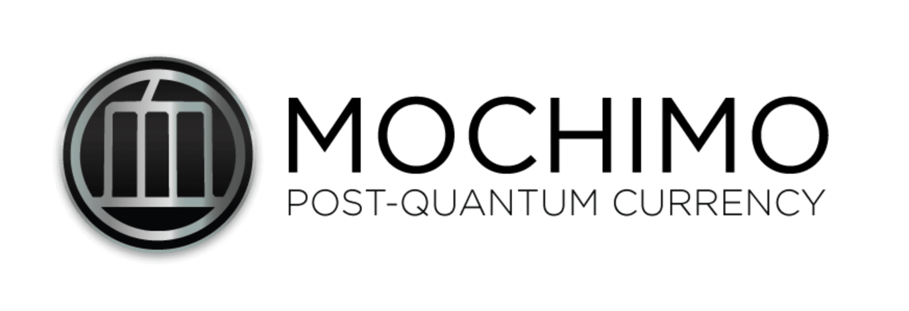

<div align="center">
<a href="https://mochimo.org/">

</a>

[](https://github.com/mochimodev/mochimo/releases)
<br>
[](https://github.com/mochimodev/mochimo/actions/workflows/tests.yaml)
[](https://github.com/mochimodev/mochimo/actions/workflows/builds.yaml)
[](https://github.com/mochimodev/mochimo/actions/workflows/codeql.yaml)
***Mochimo Services***  
[](https://chromewebstore.google.com/detail/mochimo-wallet/fkogefgjocnflhankmffnibdofdiiiho)
[](https://github.com/adequatesystems/mochimo-meshapi)

*You must read and agree to the [LICENSE](https://mochimo.org/license.pdf)
prior to running the code.*

**This repository is home to the Mochimo Cryptocurrency Engine code (main-net).**<br/>
It includes a fully functional cryptocurrency network node and (NVIDIA-only) GPU Miner. Designed to compile for most 64-bit Linux-based machines using the provided GNU Makefile. However, please note that some systems may require additional compilation parameters to build successfully.

</div>

<hr><hr>
<h1 align="center"><strong>OTHER SERVICES</strong></h1>

### [Mochimo Wallet](https://chromewebstore.google.com/detail/mochimo-wallet/fkogefgjocnflhankmffnibdofdiiiho)
Chromium Wallet that can be installed on your choice of Chromium Web Browser as an extension. Legacy Mojo Wallets can be imported into the Chromium Wallet as individual accounts.

### [Mochimo Mesh API](https://github.com/NickP005/mochimo-mesh)
An API written in Go, intended to comply with the Rosetta Mesh API standard.

<hr><hr>
<h1 align="center"><strong>REQUIREMENTS</strong></h1>

## Minimum Hardware
- (CPU) Dual-core Processor
- (RAM) 2GB of Random Access Memory
- (SSD) 64GB of Solid State Drive Storage
- (NETWORK) Port 2095 incoming TCP/IPv4 access
  - *may require router [port forwarding](https://portforward.com/)*

<hr><hr>
<h1 align="center"><strong>USAGE</strong></h1>

## Automatic Install Service
A setup script is provided to quickly provision or update a Mochimo Node on a Ubuntu Machine. The script will automatically download, build and install a Mochimo Node as a background service.
```sh
curl -L mochimo.org/setup.x | sudo bash -
# ... requires curl (usually pre-installed)
```
... or to install a specific branch, run:
```sh
curl -L mochimo.org/setup.x | sudo bash -s -- <branch>
```

## Uninstall Service
To uninstall a Mochimo Node installed as a service, find your mochimo repositories within `~/.mcm/repo` and change directory to the latest you installed, or `master`, and do `make uninstall` (requires sudo).
```sh
[sudo] make uninstall -C ~/.mcm/repo/master
```

## Build manually
Whatever the reason, build manually with:
```sh
# clone repository, if not already, and change directory
git clone https://github.com/mochimodev/mochimo.git
# (optionally) select a version
git -C mochimo/ checkout v3.0.0
# build mochimo to mochimo/bin/
make -C mochimo/ mochimo
```

## Build GPU Miner
*GPU Miner ONLY supports SOLO mining with NVIDIA cards*<br/>
Building GPU Miner from source requires an appropriate [CUDA Toolkit](https://developer.nvidia.com/cuda-downloads) installation compatible with your target GPUs.
```sh
git clone https://github.com/mochimodev/mochimo.git
make -C mochimo/ miner
# mochimo/bin/gpuminer --help
```
... if you have 10-series NVIDIA cards or lower, compile for your target architecture:
```sh
make -C mochimo/ miner NVCCARGS=-arch=sm_61 # 10-series cards
# mochimo/bin/gpuminer --help
```

<hr><hr>
<h1 align="center"><strong>LICENSE</strong></h1>

<sup>**The license to use versions of the code prior to v2.0 expired on December 31st, 2018. Use of the old code is strictly prohibited.**</sup><br/>
The current version of the code is released under an MPL2.0 derivative Open Source license.<br/>
The community is free to develop and change the code with the caveat that any changes must be for the benefit of the Mochimo cryptocurrency network (with a number of exclusions).<br/>
Please read the [LICENSE](https://mochimo.org/license.pdf) for more details on limitations and restrictions.

Contact: support@mochimo.org

<hr><hr>
<h1 align="center"><strong>COMMUNITY</strong></h1>

Discord is our most active social forum where you can discuss Mochimo with the rest of the developer and beta testing community.
- [](https://discord.mochimap.com)
- [](https://twitter.com/mochimocrypto)
- [](https://www.reddit.com/r/mochimo/)
- [](https://www.youtube.com/channel/UCFW0_JZR32gMvEtJQ3YE0KA)
- [](https://t.me/mochimocrypto)
- [](https://medium.com/mochimo-official)
